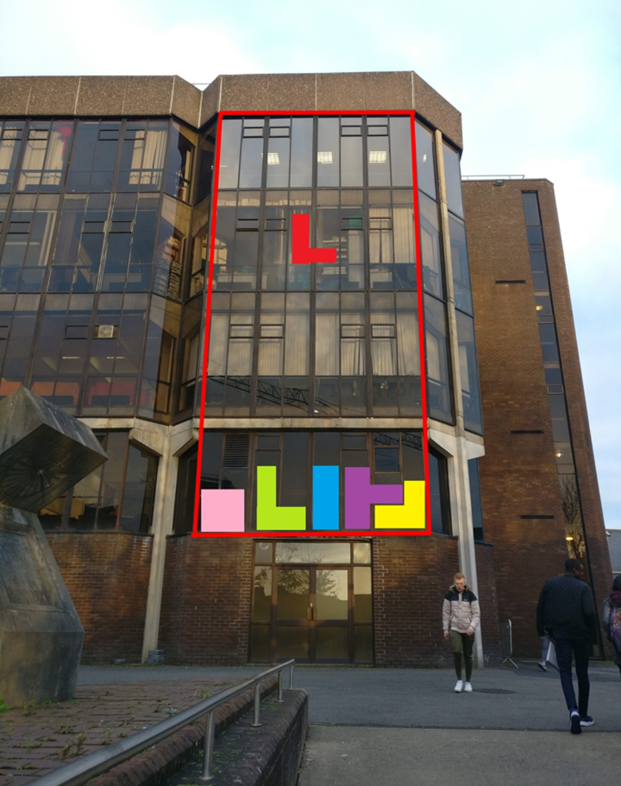
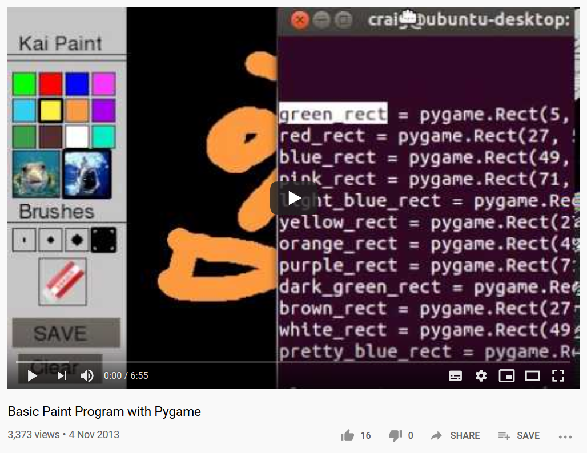

# ULPaints
Python learning and discovery journal, whilst producing a semi-useful software.

## Objective 
As you can see from the image below this is what a project to use a new different style of media sharing would look like. You could play games like tetris, you could use block text to write messives or create pixel art movies and stream them to the wall.

In the finished project there would be light panels behind each section of the windows and they could be controlled remotely to turn on and off and display colours on demand.

Eventually my thought process turned to how are you going to have someones idea for a image or movie and convert that into what you see on the wall. I always liked the idea of Paint, MSPaint had my attention for a lot of my childhood. So I wanted to create something like Paint but for drawing block art that could be used for the project of controlling a wall of light. 

## First thing I did - Printing Co-Ordinates
I wanted to create a grid that had the grid co-ordinates of each light panel for the full UL lighting up a wall face project.
To do this I created a program that accepted two inputs from the terminal, width,height and it prints out the co-ordinates starting from 0,0 up to whatever. It does it in two ways having the origin in the top left and the traditional origin starting point at bottom left.

The file is [Link to the code, coords-cli.py](coords_cli.py)

~~~~
> Enter Grid Width and Height(Integer)(Use the comma): w,h 3,5
: 0,0 : 0,1 : 0,2 : 
: 1,0 : 1,1 : 1,2 : 
: 2,0 : 2,1 : 2,2 : 
: 3,0 : 3,1 : 3,2 : 
: 4,0 : 4,1 : 4,2 : 
----------------
: 5,0 : 5,1 : 5,2 : 
: 4,0 : 4,1 : 4,2 : 
: 3,0 : 3,1 : 3,2 : 
: 2,0 : 2,1 : 2,2 : 
: 1,0 : 1,1 : 1,2 : 
: 0,0 : 0,1 : 0,2 : 
~~~~

## Visualising Co-Ordinates on a graph
I already had a [graph](old_graph.py) created from a previous project using matplotlib to graph two streams of values. I thought maybe I can just plot points on the graph and use this in some way. 

So I went ahead and modified it to only display points on a graph. My idea was each point would be a light turned on.
(I realised quickly after this wouldnt work.)
[Scatter plot representing each light point](graph.py)

## Realising PyGame is where I wanted to be
After my realisation matplotlib wouldnt work for my needs I remembered all of my Java lectures of drawing squares and shapes through the code and thought, Hey I can do this on Python. Did a search of the web "Draw a rectangle on pygame". Sure enough I found [StackOverflow](https://stackoverflow.com/questions/19780411/pygame-drawing-a-rectangle "StackOverflow") and found the right direction with PyGame.

I modified the code in the link along with the logic from the code higher up on coords_cli.py to draw multiple rectangles on a graph.
[Code that prints a few rectangles in the shape of the UL lighted up wall](pygame_rect.py)

## Back to my idea of Paint
I wanted to create a modified version of paint that only has blocks. So I need to know how Paint programs work in order to create a different one. Again back to searching and I found a YouTube video with source code included. This is a Paint program created in PyGame by a 14 year old. 

## Stripping the Paint program
I want a modified paint program not a paint program. Removing one feature from the program is hard but its a great way to learn about the overall program. I removed stickers and I removed the eraser and other features. 
[Modified Paint program, paint.py](paint.py)

